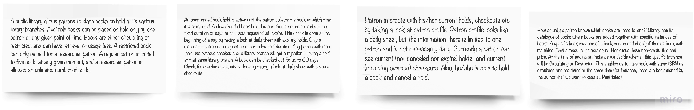
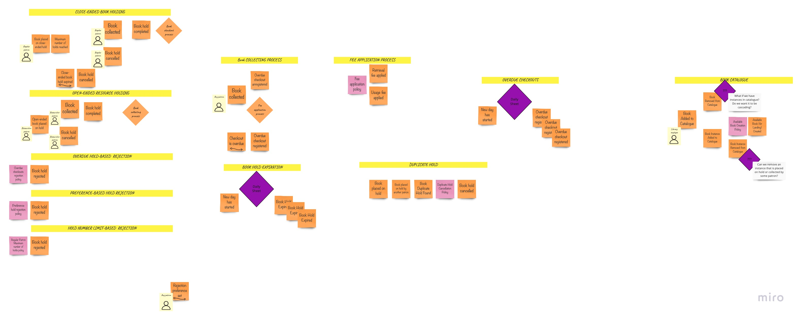
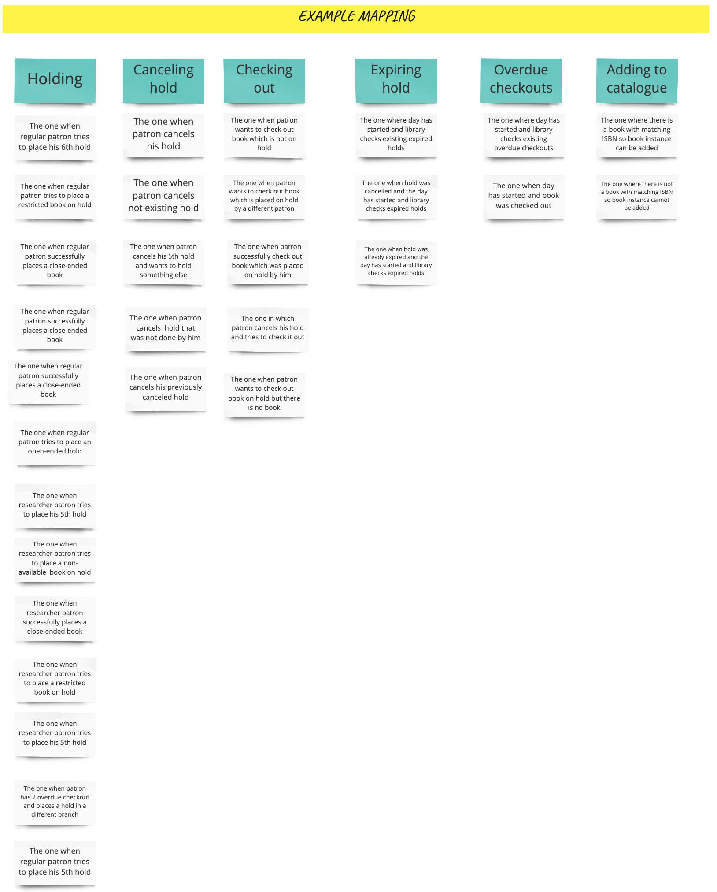
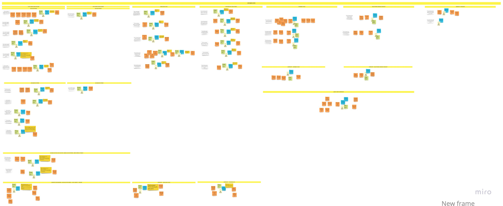
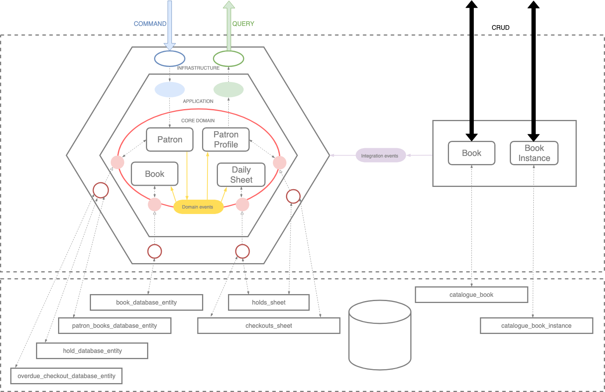
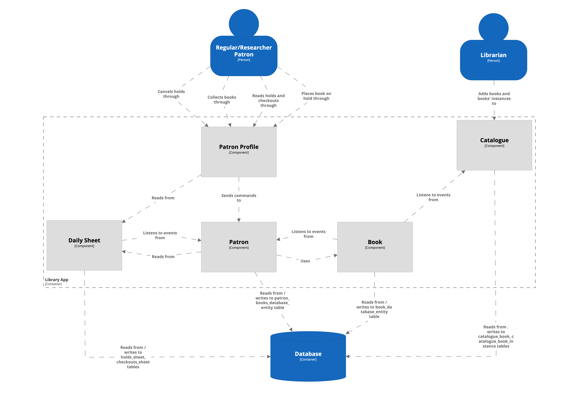
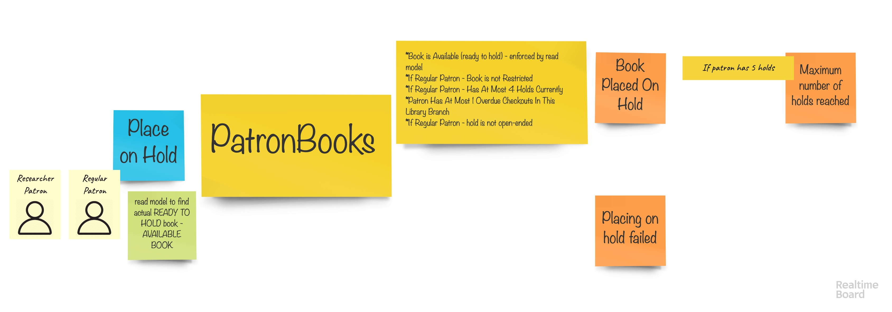

[](https://circleci.com/gh/ddd-by-examples/library)
[](https://codecov.io/gh/ddd-by-examples/library)

# Table of contents

1. [About](#about)
2. [Domain description](#domain-description)
3. [General assumptions](#general-assumptions)  
    3.1 [Process discovery](#process-discovery)  
    3.2 [Project structure and architecture](#project-structure-and-architecture)    
    3.3 [Aggregates](#aggregates)  
    3.4 [Events](#events)  
    3.4.1 [Events in Repositories](#events-in-repositories)   
    3.5 [ArchUnit](#archunit)  
    3.6 [Functional thinking](#functional-thinking)  
    3.7 [No ORM](#no-orm)  
    3.8 [Architecture-code gap](#architecture-code-gap)  
    3.9 [Model-code gap](#model-code-gap)   
    3.10 [Spring](#spring)  
    3.11 [Tests](#tests)  
4. [How to contribute](#how-to-contribute)
5. [References](#references)

## About

This is a project of a library, driven by real [business requirements](#domain-description).
We use techniques strongly connected with Domain Driven Design, Behavior-Driven Development,
Event Storming, User Story Mapping. 

## Domain description

A public library allows patrons to place books on hold at its various library branches.
Available books can be placed on hold only by one patron at any given point in time.
Books are either circulating or restricted, and can have retrieval or usage fees.
A restricted book can only be held by a researcher patron. A regular patron is limited
to five holds at any given moment, while a researcher patron is allowed an unlimited number
of holds. An open-ended book hold is active until the patron checks out the book, at which time it
is completed. A closed-ended book hold that is not completed within a fixed number of 
days after it was requested will expire. This check is done at the beginning of a day by 
taking a look at daily sheet with expiring holds. Only a researcher patron can request
an open-ended hold duration. Any patron with more than two overdue checkouts at a library
branch will get a rejection if trying a hold at that same library branch. A book can be
checked out for up to 60 days. Check for overdue checkouts is done by taking a look at
daily sheet with overdue checkouts. Patron interacts with his/her current holds, checkouts, etc.
by taking a look at patron profile. Patron profile looks like a daily sheet, but the
information there is limited to one patron and is not necessarily daily. Currently a
patron can see current holds (not canceled nor expired) and current checkouts (including overdue).
Also, he/she is able to hold a book and cancel a hold.

How actually a patron knows which books are there to lend? Library has its catalogue of
books where books are added together with their specific instances. A specific book
instance of a book can be added only if there is book with matching ISBN already in
the catalogue.  Book must have non-empty title and price. At the time of adding an instance
we decide whether it will be Circulating or Restricted. This enables
us to have book with same ISBN as circulated and restricted at the same time (for instance,
there is a book signed by the author that we want to keep as Restricted)

## General assumptions

### Process discovery

The first thing we started with was domain exploration with the help of Big Picture EventStorming.
The description you found in the previous chapter, landed on our virtual wall:    
   
The EventStorming session led us to numerous discoveries, modeled with the sticky notes:  
   
During the session we discovered following definitions:  
    

This made us think of real life scenarios that might happen. We discovered them described with the help of
the **Example mapping**:  
  

This in turn became the base for our *Design Level* sessions, where we analyzed each example:  
  

Please follow the links below to get more details on each of the mentioned steps:
- [Big Picture EventStorming](./docs/big-picture.md)
- [Example Mapping](docs/example-mapping.md)
- [Design Level EventStorming](docs/design-level.md)

### Project structure and architecture
At the very beginning, not to overcomplicate the project, we decided to assign each bounded context
to a separate package, which means that the system is a modular monolith. There are no obstacles, though,
to put contexts into maven modules or finally into microservices.

Bounded contexts should (amongst others) introduce autonomy in the sense of architecture. Thus, each module
encapsulating the context has its own local architecture aligned to problem complexity.
In the case of a context, where we identified true business logic (**lending**) we introduced a domain model
that is a simplified (for the purpose of the project) abstraction of the reality and utilized
hexagonal architecture. In the case of a context, that during Event Storming turned out to lack any complex
domain logic, we applied CRUD-like local architecture.  

 

If we are talking about hexagonal architecture, it lets us separate domain and application logic from
frameworks (and infrastructure). What do we gain with this approach? Firstly, we can unit test most important
part of the application - **business logic** - usually without the need to stub any dependency.
Secondly, we create ourselves an opportunity to adjust infrastructure layer without the worry of
breaking the core functionality. In the infrastructure layer we intensively use Spring Framework
as probably the most mature and powerful application framework with an incredible test support.
More information about how we use Spring you will find [here](#spring).

As we already mentioned, the architecture was driven by Event Storming sessions. Apart from identifying
contexts and their complexity, we could also make a decision that we separate read and write models (CQRS).
As an example you can have a look at **Patron Profiles** and *Daily Sheets*.

### Aggregates
Aggregates discovered during Event Storming sessions communicate with each other with events. There is
a contention, though, should they be consistent immediately or eventually? As aggregates in general
determine business boundaries, eventual consistency sounds like a better choice, but choices in software
are never costless. Providing eventual consistency requires some infrastructural tools, like message broker
or event store. That's why we could (and did) start with immediate consistency.

> Good architecture is the one which postpones all important decisions

... that's why we made it easy to change the consistency model, providing tests for each option, including
basic implementations based on **DomainEvents** interface, which can be adjusted to our needs and
toolset in future. Let's have a look at following examples:

* Immediate consistency
    ```groovy
    def 'should synchronize Patron, Book and DailySheet with events'() {
        given:
            bookRepository.save(book)
        and:
            patronRepo.publish(patronCreated())
        when:
            patronRepo.publish(placedOnHold(book))
        then:
            patronShouldBeFoundInDatabaseWithOneBookOnHold(patronId)
        and:
            bookReactedToPlacedOnHoldEvent()
        and:
            dailySheetIsUpdated()
    }
    
    boolean bookReactedToPlacedOnHoldEvent() {
        return bookRepository.findBy(book.bookId).get() instanceof BookOnHold
    }
    
    boolean dailySheetIsUpdated() {
        return new JdbcTemplate(datasource).query("select count(*) from holds_sheet s where s.hold_by_patron_id = ?",
                [patronId.patronId] as Object[],
                new ColumnMapRowMapper()).get(0)
                .get("COUNT(*)") == 1
    }
    ```
   _Please note that here we are just reading from database right after events are being published_
   
   Simple implementation of the event bus is based on Spring application events:
    ```java
    @AllArgsConstructor
    public class JustForwardDomainEventPublisher implements DomainEvents {
    
        private final ApplicationEventPublisher applicationEventPublisher;
    
        @Override
        public void publish(DomainEvent event) {
            applicationEventPublisher.publishEvent(event);
        }
    }
    ```

* Eventual consistency
    ```groovy
    def 'should synchronize Patron, Book and DailySheet with events'() {
        given:
            bookRepository.save(book)
        and:
            patronRepo.publish(patronCreated())
        when:
            patronRepo.publish(placedOnHold(book))
        then:
            patronShouldBeFoundInDatabaseWithOneBookOnHold(patronId)
        and:
            bookReactedToPlacedOnHoldEvent()
        and:
            dailySheetIsUpdated()
    }
    
    void bookReactedToPlacedOnHoldEvent() {
        pollingConditions.eventually {
            assert bookRepository.findBy(book.bookId).get() instanceof BookOnHold
        }
    }
    
    void dailySheetIsUpdated() {
        pollingConditions.eventually {
            assert countOfHoldsInDailySheet() == 1
        }
    }
    ```
    _Please note that the test looks exactly the same as previous one, but now we utilized Groovy's
    **PollingConditions** to perform asynchronous functionality tests_

    Sample implementation of event bus is following:
    
    ```java
    @AllArgsConstructor
    public class StoreAndForwardDomainEventPublisher implements DomainEvents {
    
        private final JustForwardDomainEventPublisher justForwardDomainEventPublisher;
        private final EventsStorage eventsStorage;
    
        @Override
        public void publish(DomainEvent event) {
            eventsStorage.save(event);
        }
    
        @Scheduled(fixedRate = 3000L)
        @Transactional
        public void publishAllPeriodically() {
            List<DomainEvent> domainEvents = eventsStorage.toPublish();
            domainEvents.forEach(justForwardDomainEventPublisher::publish);
            eventsStorage.published(domainEvents);
        }
    }
    ```

To clarify, we should always aim for aggregates that can handle a business operation atomically
(transactionally if you like), so each aggregate should be as independent and decoupled from other
aggregates as possible. Thus, eventual consistency is promoted. As we already mentioned, it comes
with some tradeoffs, so from the pragmatic point of view immediate consistency is also a choice.
You might ask yourself a question now: _What if I don't have any events yet?_. Well, a pragmatic
approach would be to encapsulate the communication between aggregates in a _Service-like_ class,
where you could call proper aggregates line by line explicitly.

### Events
Talking about inter-aggregate communication, we must remember that events reduce coupling, but don't remove
it completely. Thus, it is very vital to share(publish) only those events, that are necessary for other
aggregates to exist and function. Otherwise there is a threat that the level of coupling will increase
introducing **feature envy**, because other aggregates might start using those events to perform actions
they are not supposed to perform. A solution to this problem could be the distinction of domain events
and integration events, which will be described here soon.  

### Events in Repositories 
Repositories are one of the most popular design pattern. They abstract our domain model from data layer. 
In other words, they deal with state. That said, a common use-case is when we pass a new state to our repository,
so that it gets persisted. It may look like so:

```java
public class BusinessService {
   
    private final PatronRepository patronRepository;
    
    void businessMethod(PatronId patronId) {
        Patron patron = patronRepository.findById(patronId);
        //do sth
        patronRepository.save(patron);
    }
}
```

Conceptually, between 1st and 3rd line of that business method we change state of our Patron from A to B. 
This change might be calculated by dirty checking or we might just override entire Patron state in the database. 
Third option is _Let's make implicit explicit_ and actually call this state change A->B an **event**. 
After all, event-driven architecture is all about promoting state changes as domain events.

Thanks to this our domain model may become immutable and just return events as results of invoking a command like so:

```java
public BookPlacedOnHold placeOnHold(AvailableBook book) {
      ...
}
```

And our repository might operate directly on events like so:

```java
public interface PatronRepository {
     void save(PatronEvent event) {
}
```

### ArchUnit

One of the main components of a successful project is technical leadership that lets the team go in the right
direction. Nevertheless, there are tools that can support teams in keeping the code clean and protect the
architecture, so that the project won't become a Big Ball of Mud, and thus will be pleasant to develop and
to maintain. The first option, the one we proposed, is [ArchUnit](https://www.archunit.org/) - a Java architecture
test tool. ArchUnit lets you write unit tests of your architecture, so that it is always consistent with initial
vision. Maven modules could be an alternative as well, but let's focus on the former.

In terms of hexagonal architecture, it is essential to ensure, that we do not mix different levels of
abstraction (hexagon levels):
```java 
@ArchTest
public static final ArchRule model_should_not_depend_on_infrastructure =
    noClasses()
        .that()
        .resideInAPackage("..model..")
        .should()
        .dependOnClassesThat()
        .resideInAPackage("..infrastructure..");
```      
and that frameworks do not affect the domain model  
```java
@ArchTest
public static final ArchRule model_should_not_depend_on_spring =
    noClasses()
        .that()
        .resideInAPackage("..io.pillopl.library.lending..model..")
        .should()
        .dependOnClassesThat()
        .resideInAPackage("org.springframework..");
```    

### Functional thinking
When you look at the code you might find a scent of functional programming. Although we do not follow
a _clean_ FP, we try to think of business processes as pipelines or workflows, utilizing functional style through
following concepts.

_Please note that this is not a reference project for FP._

#### Immutable objects
Each class that represents a business concept is immutable, thanks to which we:
* provide full encapsulation and objects' states protection,
* secure objects for multithreaded access,
* control all side effects much clearer. 

#### Pure functions
We model domain operations, discovered in Design Level Event Storming, as pure functions, and declare them in
both domain and application layers in the form of Java's functional interfaces. Their implementations are placed
in infrastructure layer as ordinary methods with side effects. Thanks to this approach we can follow the abstraction
of ubiquitous language explicitly, and keep this abstraction implementation-agnostic. As an example, you could have
a look at `FindAvailableBook` interface and its implementation:

```java
@FunctionalInterface
public interface FindAvailableBook {

    Option<AvailableBook> findAvailableBookBy(BookId bookId);
}
```

```java
@AllArgsConstructor
class BookDatabaseRepository implements FindAvailableBook {

    private final JdbcTemplate jdbcTemplate;

    @Override
    public Option<AvailableBook> findAvailableBookBy(BookId bookId) {
        return Match(findBy(bookId)).of(
                Case($Some($(instanceOf(AvailableBook.class))), Option::of),
                Case($(), Option::none)
        );
    }  

    Option<Book> findBy(BookId bookId) {
        return findBookById(bookId)
                .map(BookDatabaseEntity::toDomainModel);
    }

    private Option<BookDatabaseEntity> findBookById(BookId bookId) {
        return Try
                .ofSupplier(() -> of(jdbcTemplate.queryForObject("SELECT b.* FROM book_database_entity b WHERE b.book_id = ?",
                                      new BeanPropertyRowMapper<>(BookDatabaseEntity.class), bookId.getBookId())))
                .getOrElse(none());
    }  
} 
```
    
#### Type system
_Type system - like_ modelling - we modelled each domain object's state discovered during EventStorming as separate
classes: `AvailableBook`, `BookOnHold`, `CheckedOutBook`. With this approach we provide much clearer abstraction than
having a single `Book` class with an enum-based state management. Moving the logic to these specific classes brings
Single Responsibility Principle to a different level. Moreover, instead of checking invariants in every business method
we leave the role to the compiler. As an example, please consider following scenario: _you can place on hold only a book
that is currently available_. We could have done it in a following way:
```java
public Either<BookHoldFailed, BookPlacedOnHoldEvents> placeOnHold(Book book) {
  if (book.status == AVAILABLE) {  
      ...
  }
}
```
but we use the _type system_ and declare method of following signature
```java
public Either<BookHoldFailed, BookPlacedOnHoldEvents> placeOnHold(AvailableBook book) {
      ...
}
```  
The more errors we discover at compile time the better.

Yet another advantage of applying such type system is that we can represent business flows and state transitions
with functions much easier. As an example, following functions:
```
placeOnHold: AvailableBook -> BookHoldFailed | BookPlacedOnHold
cancelHold: BookOnHold -> BookHoldCancelingFailed | BookHoldCanceled
``` 
are much more concise and descriptive than these:
```
placeOnHold: Book -> BookHoldFailed | BookPlacedOnHold
cancelHold: Book -> BookHoldCancelingFailed | BookHoldCanceled
```
as here we have a lot of constraints hidden within function implementations.

Moreover if you think of your domain as a set of operations (functions) that are being executed on business objects
(aggregates) you don't think of any execution model (like async processing). It is fine, because you don't have to.
Domain functions are free from I/O operations, async, and other side-effects-prone things, which are put into the
infrastructure layer. Thanks to this, we can easily test them without mocking mentioned parts. 

#### Monads
Business methods might have different results. One might return a value or a `null`, throw an exception when something
unexpected happens or just return different objects under different circumstances. All those situations are typical
to object-oriented languages like Java, but do not fit into functional style. We are dealing with this issues
with monads (monadic containers provided by [Vavr](https://www.vavr.io)):
* When a method returns optional value, we use the `Option` monad:

    ```java
    Option<Book> findBy(BookId bookId) {
        ...
    }
    ```

* When a method might return one of two possible values, we use the `Either` monad:

    ```java
    Either<BookHoldFailed, BookPlacedOnHoldEvents> placeOnHold(AvailableBook book) {
        ...
    }
    ```

* When an exception might occur, we use `Try` monad:

    ```java
    Try<Result> placeOnHold(@NonNull PlaceOnHoldCommand command) {
        ...
    }
    ```

Thanks to this, we can follow the functional programming style, but we also enrich our domain language and
make our code much more readable for the clients.

#### Pattern Matching
Depending on a type of a given book object we often need to perform different actions. Series of if/else or switch/case statements
could be a choice, but it is the pattern matching that provides the most conciseness and flexibility. With the code
like below we can check numerous patterns against objects and access their constituents, so our code has a minimal dose
of language-construct noise:
```java
private Book handleBookPlacedOnHold(Book book, BookPlacedOnHold bookPlacedOnHold) {
    return API.Match(book).of(
        Case($(instanceOf(AvailableBook.class)), availableBook -> availableBook.handle(bookPlacedOnHold)),
        Case($(instanceOf(BookOnHold.class)), bookOnHold -> raiseDuplicateHoldFoundEvent(bookOnHold, bookPlacedOnHold)),
        Case($(), () -> book)
    );
}
```

### (No) ORM
If you run `mvn dependency:tree` you won't find any JPA implementation. Although we think that ORM solutions (like Hibernate)
are very powerful and useful, we decided not to use them, as we wouldn't utilize their features. What features are
talking about? Lazy loading, caching, dirty checking. Why don't we need them? We want to have more control
over SQL queries and minimize the object-relational impedance mismatch ourselves. Moreover, thanks to relatively
small aggregates, containing as little data as it is required to protect the invariants, we don't need the
lazy loading mechanism either.
With Hexagonal Architecture we have the ability to separate domain and persistence models and test them
independently. Moreover, we can also introduce different persistence strategies for different aggregates. 
In this project, we utilize both plain SQL queries and `JdbcTemplate` and use new and very promising 
project called Spring Data JDBC, that is free from the JPA-related overhead mentioned before.
Please find below an example of a repository:

```java
interface PatronEntityRepository extends CrudRepository<PatronDatabaseEntity, Long> {

    @Query("SELECT p.* FROM patron_database_entity p where p.patron_id = :patronId")
    PatronDatabaseEntity findByPatronId(@Param("patronId") UUID patronId);

}
```

At the same time we propose other way of persisting aggregates, with plain SQL queries and `JdbcTemplate`:  

```java
@AllArgsConstructor
class BookDatabaseRepository implements BookRepository, FindAvailableBook, FindBookOnHold {

    private final JdbcTemplate jdbcTemplate;

    @Override
    public Option<Book> findBy(BookId bookId) {
        return findBookById(bookId)
                .map(BookDatabaseEntity::toDomainModel);
    }

    private Option<BookDatabaseEntity> findBookById(BookId bookId) {
        return Try
                .ofSupplier(() -> of(jdbcTemplate.queryForObject("SELECT b.* FROM book_database_entity b WHERE b.book_id = ?",
                                     new BeanPropertyRowMapper<>(BookDatabaseEntity.class), bookId.getBookId())))
                .getOrElse(none());
    }
    
    ...
}
```
_Please note that despite having the ability to choose different persistence implementations for aggregates
it is recommended to stick to one option within the app/team_ 
    
### Architecture-code gap
We put a lot of attention to keep the consistency between the overall architecture (including diagrams)
and the code structure. Having identified bounded contexts we could organize them in modules (packages, to
be more specific). Thanks to this we gain the famous microservices' autonomy, while having a monolithic
application. Each package has well defined public API, encapsulating all implementation details by using
package-protected or private scopes.

Just by looking at the package structure:

```
└── library
    ├── catalogue
    ├── commons
    │   ├── aggregates
    │   ├── commands
    │   └── events
    │       └── publisher
    └── lending
        ├── book
        │   ├── application
        │   ├── infrastructure
        │   └── model
        ├── dailysheet
        │   ├── infrastructure
        │   └── model
        ├── librarybranch
        │   └── model
        ├── patron
        │   ├── application
        │   ├── infrastructure
        │   └── model
        └── patronprofile
            ├── infrastructure
            ├── model
            └── web
```
you can see that the architecture is screaming that it has two bounded contexts: **catalogue**
and **lending**. Moreover, the **lending context** is built around five business objects: **book**,
**dailysheet**, **librarybranch**, **patron**, and **patronprofile**, while **catalogue** has no subpackages,
which suggests that it might be a CRUD with no complex logic inside. Please find the architecture diagram
below.



Yet another advantage of this approach comparing to packaging by layer for example is that in order to 
deliver a functionality you would usually need to do it in one package only, which is the aforementioned
autonomy. This autonomy, then, could be transferred to the level of application as soon as we split our
_context-packages_ into separate microservices. Following this considerations, autonomy can be given away
to a product team that can take care of the whole business area end-to-end.

### Model-code gap
In our project we do our best to reduce _model-code gap_ to bare minimum. It means we try to put equal attention
to both the model and the code and keep them consistent. Below you will find some examples.

#### Placing on hold


Starting with the easiest part, below you will find the model classes corresponding to depicted command and events:

```java
@Value
class PlaceOnHoldCommand {
    ...
}
```
```java
@Value
class BookPlacedOnHold implements PatronEvent {
    ...
}
```
```java
@Value
class MaximumNumberOfHoldsReached implements PatronEvent {
    ...    
}
```
```java
@Value
class BookHoldFailed implements PatronEvent {
    ...
}
```

We know it might not look impressive now, but if you have a look at the implementation of an aggregate,
you will see that the code reflects not only the aggregate name, but also the whole scenario of `PlaceOnHold` 
command handling. Let us uncover the details:

```java
public class Patron {

    public Either<BookHoldFailed, BookPlacedOnHoldEvents> placeOnHold(AvailableBook book) {
        return placeOnHold(book, HoldDuration.openEnded());
    }
    
    ...
}    
```

The signature of `placeOnHold` method screams, that it is possible to place a book on hold only when it
is available (more information about protecting invariants by compiler you will find in [Type system section](#type-system)).
Moreover, if you try to place available book on hold it can **either** fail (`BookHoldFailed`) or produce some events -
what events?

```java
@Value
class BookPlacedOnHoldEvents implements PatronEvent {
    @NonNull UUID eventId = UUID.randomUUID();
    @NonNull UUID patronId;
    @NonNull BookPlacedOnHold bookPlacedOnHold;
    @NonNull Option<MaximumNumberOfHoldsReached> maximumNumberOfHoldsReached;

    @Override
    public Instant getWhen() {
        return bookPlacedOnHold.when;
    }

    public static BookPlacedOnHoldEvents events(BookPlacedOnHold bookPlacedOnHold) {
        return new BookPlacedOnHoldEvents(bookPlacedOnHold.getPatronId(), bookPlacedOnHold, Option.none());
    }

    public static BookPlacedOnHoldEvents events(BookPlacedOnHold bookPlacedOnHold, MaximumNumberOfHoldsReached maximumNumberOfHoldsReached) {
        return new BookPlacedOnHoldEvents(bookPlacedOnHold.patronId, bookPlacedOnHold, Option.of(maximumNumberOfHoldsReached));
    }

    public List<DomainEvent> normalize() {
        return List.<DomainEvent>of(bookPlacedOnHold).appendAll(maximumNumberOfHoldsReached.toList());
    }
}
```

`BookPlacedOnHoldEvents` is a container for `BookPlacedOnHold` event, and - if patron has 5 book placed on hold already -
`MaximumNumberOfHoldsReached` (please mind the `Option` monad). You can see now how perfectly the code reflects
the model.

It is not everything, though. In the picture above you can also see a big rectangular yellow card with rules (policies)
that define the conditions that need to be fulfilled in order to get the given result. All those rules are implemented 
as functions **either** allowing or rejecting the hold:


```java
PlacingOnHoldPolicy onlyResearcherPatronsCanHoldRestrictedBooksPolicy = (AvailableBook toHold, Patron patron, HoldDuration holdDuration) -> {
    if (toHold.isRestricted() && patron.isRegular()) {
        return left(Rejection.withReason("Regular patrons cannot hold restricted books"));
    }
    return right(new Allowance());
};
```


```java
PlacingOnHoldPolicy overdueCheckoutsRejectionPolicy = (AvailableBook toHold, Patron patron, HoldDuration holdDuration) -> {
    if (patron.overdueCheckoutsAt(toHold.getLibraryBranch()) >= OverdueCheckouts.MAX_COUNT_OF_OVERDUE_RESOURCES) {
        return left(Rejection.withReason("cannot place on hold when there are overdue checkouts"));
    }
    return right(new Allowance());
};
```


```java
PlacingOnHoldPolicy regularPatronMaximumNumberOfHoldsPolicy = (AvailableBook toHold, Patron patron, HoldDuration holdDuration) -> {
    if (patron.isRegular() && patron.numberOfHolds() >= PatronHolds.MAX_NUMBER_OF_HOLDS) {
        return left(Rejection.withReason("patron cannot hold more books"));
    }
    return right(new Allowance());
};
```


```java
PlacingOnHoldPolicy onlyResearcherPatronsCanPlaceOpenEndedHolds = (AvailableBook toHold, Patron patron, HoldDuration holdDuration) -> {
    if (patron.isRegular() && holdDuration.isOpenEnded()) {
        return left(Rejection.withReason("regular patron cannot place open ended holds"));
    }
    return right(new Allowance());
};
```

#### Spring
Spring Framework seems to be the most popular Java framework ever used. Unfortunately it is also quite common
to overuse its features in the business code. What you find in this project is that the domain packages
are fully focused on modelling business problems, and are free from any DI, which makes it easy to
unit-test it which is invaluable in terms of code reliability and maintainability. It does not mean,
though, that we do not use Spring Framework - we do. Below you will find some details:
- Each bounded context has its own independent application context. It means that we removed the runtime
coupling, which is a step towards extracting modules (and microservices). How did we do that? Let's have
a look:
    ```java
    @SpringBootConfiguration
    @EnableAutoConfiguration
    public class LibraryApplication {
    
        public static void main(String[] args) {
            new SpringApplicationBuilder()
                    .parent(LibraryApplication.class)
                    .child(LendingConfig.class).web(WebApplicationType.SERVLET)
                    .sibling(CatalogueConfiguration.class).web(WebApplicationType.NONE)
                    .run(args);
        }
    }
    ```
- As you could see above, we also try not to use component scan wherever possible. Instead we utilize
`@Configuration` classes where we define module specific beans in the infrastructure layer. Those
configuration classes are explicitly declared in the main application class.

### Tests
Tests are written in a BDD manner, expressing stories defined with Example Mapping.
It means we utilize both TDD and Domain Language discovered with Event Storming. 

We also made an effort to show how to create a DSL, that enables to write
tests as if they were sentences taken from the domain descriptions. Please
find an example below:

```groovy
def 'should make book available when hold canceled'() {
    given:
        BookDSL bookOnHold = aCirculatingBook() with anyBookId() locatedIn anyBranch() placedOnHoldBy anyPatron()
    and:
        PatronEvent.BookHoldCanceled bookHoldCanceledEvent = the bookOnHold isCancelledBy anyPatron()

    when:
        AvailableBook availableBook = the bookOnHold reactsTo bookHoldCanceledEvent
    then:
        availableBook.bookId == bookOnHold.bookId
        availableBook.libraryBranch == bookOnHold.libraryBranchId
        availableBook.version == bookOnHold.version
}
``` 
_Please also note the **when** block, where we manifest the fact that books react to 
cancellation event_

## How to contribute

The project is still under construction, so if you like it enough to collaborate, just let us
know or simply create a Pull Request.


## How to Build

### Requirements

* Java 11
* Maven

### Quickstart

You can run the library app by simply typing the following:

```console
$ mvn spring-boot:run
...
...
2019-04-03 15:55:39.162  INFO 18957 --- [           main] o.s.b.a.e.web.EndpointLinksResolver      : Exposing 2 endpoint(s) beneath base path '/actuator'
2019-04-03 15:55:39.425  INFO 18957 --- [           main] o.s.b.w.embedded.tomcat.TomcatWebServer  : Tomcat started on port(s): 8080 (http) with context path ''
2019-04-03 15:55:39.428  INFO 18957 --- [           main] io.pillopl.library.LibraryApplication    : Started LibraryApplication in 5.999 seconds (JVM running for 23.018)

```

### Build a Jar package

You can build a jar with maven like so:

```console
$ mvn clean package
...
...
[INFO] Building jar: /home/pczarkowski/development/spring/library/target/library-0.0.1-SNAPSHOT.jar
[INFO] ------------------------------------------------------------------------
[INFO] BUILD SUCCESS
[INFO] ------------------------------------------------------------------------
```

### Build with Docker

If you've already built the jar file you can run:

```console
docker build -t spring/library .
```

Otherwise you can build the jar file using the multistage dockerfile:

```console
docker build -t spring/library -f Dockerfile.build .
```

Either way once built you can run it like so:

```console
$ docker run -ti --rm --name spring-library -p 8080:8080 spring/library
```

### Production ready metrics and visualization
To run the application as well as Prometheus and Grafana dashboard for visualizing metrics you can run all services:

```console
$ docker-compose up
```

If everything goes well, you can access the following services at given location:
* http://localhost:8080/actuator/prometheus - published Micrometer metrics
* http://localhost:9090 - Prometheus dashboard
* http://localhost:3000 - Grafana dashboard

In order to see some metrics, you must create a dashboard. Go to `Create` -> `Import` and select attached `jvm-micrometer_rev8.json`. File has been pulled from 
`https://grafana.com/grafana/dashboards/4701`.

Please note application will be run with `local` Spring profile to setup some initial data.

## References

1. [Introducing EventStorming](https://leanpub.com/introducing_eventstorming) by Alberto Brandolini
2. [Domain Modelling Made Functional](https://pragprog.com/book/swdddf/domain-modeling-made-functional) by Scott Wlaschin
3. [Software Architecture for Developers](https://softwarearchitecturefordevelopers.com) by Simon Brown
4. [Clean Architecture](https://www.amazon.com/Clean-Architecture-Craftsmans-Software-Structure/dp/0134494164) by Robert C. Martin
5. [Domain-Driven Design: Tackling Complexity in the Heart of Software](https://www.amazon.com/Domain-Driven-Design-Tackling-Complexity-Software/dp/0321125215) by Eric Evans
