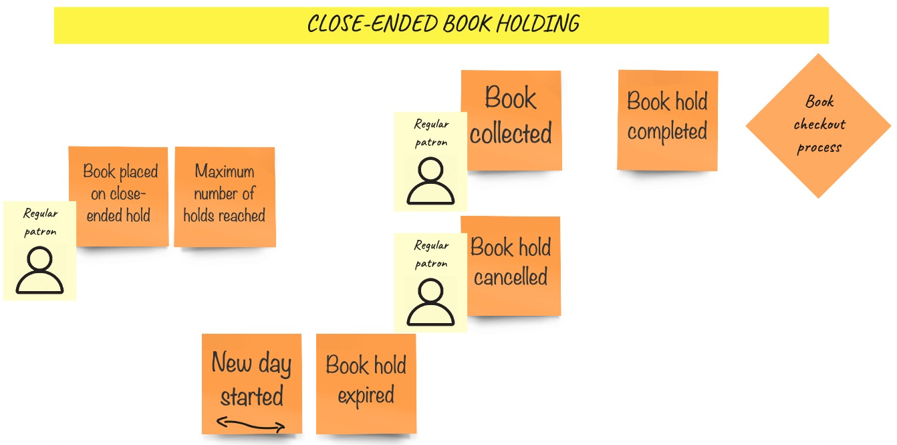
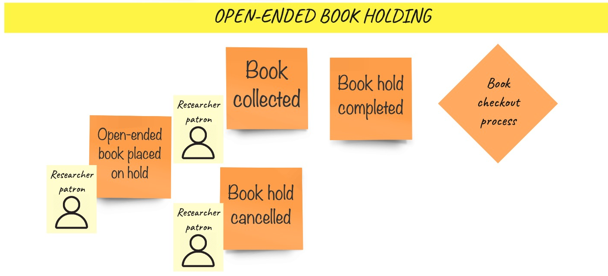
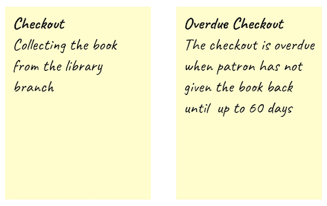

# Big Picture EventStorming

We started the domain exploration with sticky notes and a pen. What turned out to be the first discovery,
was the **close-ended book holding** process:
  
  
  
Let's briefly walk through it:
- A **Regular Patron** can **place a book on a close-ended hold**  
- A **Regular Patron** might **reach a maximum holds number** after a **hold is placed**  
- A **Regular Patron** can either **cancel the hold** or **collect the book**  
- While the book is **collected** the **hold is completed** and so the **checkout process** starts  
- Whenever a new day starts, we check if a hold is not hanging for too long. If so, the **book hold is expired**  

On the high level, the process looks clear now, but it does not work the way, that all of us
interpreted each word written no the sticky note similarly. That's why we established some definitions:  

  

Similar discoveries were made around **open-ened book holding** process:  

  

- A **Researcher Patron** can **place a book on an open-ended hold**
- A **Researcher Patron** can either **cancel the hold** or **collect a book**
- While the book is **collected** the **hold is completed** and so the **checkout process** starts
- Within the **open-ended holding** a **hold** cannot **expire** (mind the lack of **hold expired** event)

All right. These two processes are very similar. The part that they have in common, and we know nothing about
it yet is called the **book checkout process**:

  

Here's what you see there described with words:
- **Any Patron** can **return a book**
- If the **checkout is overdue**, it is being unregistered as soon as the **book is returned**
- In the moment of **returning a book** we start the process of **Fees application**
- From the moment of **book collection**, a patron might not checkout the book on time. Whenever a **new day starts**
we find and **register overdue checkouts**

Wait, but what is this **checkout**?  

  

_- OK, now tell me what is this fee application process_  
_- Nope, it is not relevant by now, will get back to it later_  
_- But wait, why? Shouldn't you get the full picture from the storming?_  
_- Yes, but remember, the time has its cost. You always need to focus on the most relevant (at this moment) business part.
I promise to get back to this at the next workshop._  
_- Fair enough!_  