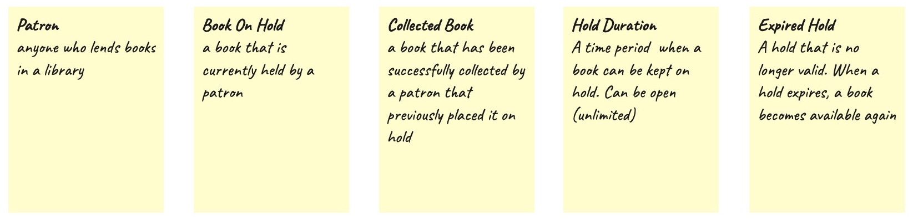
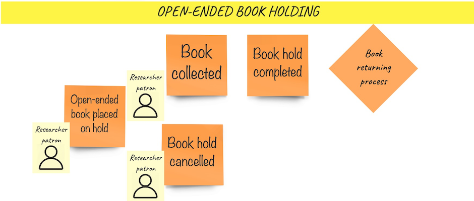
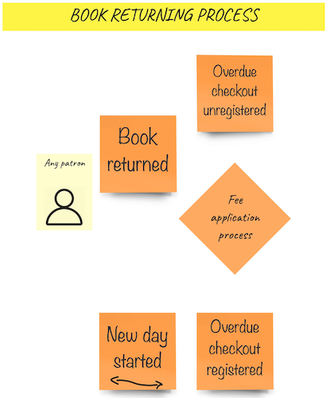
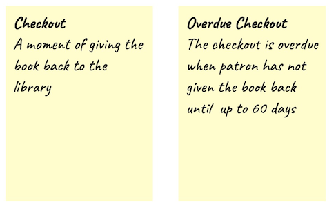
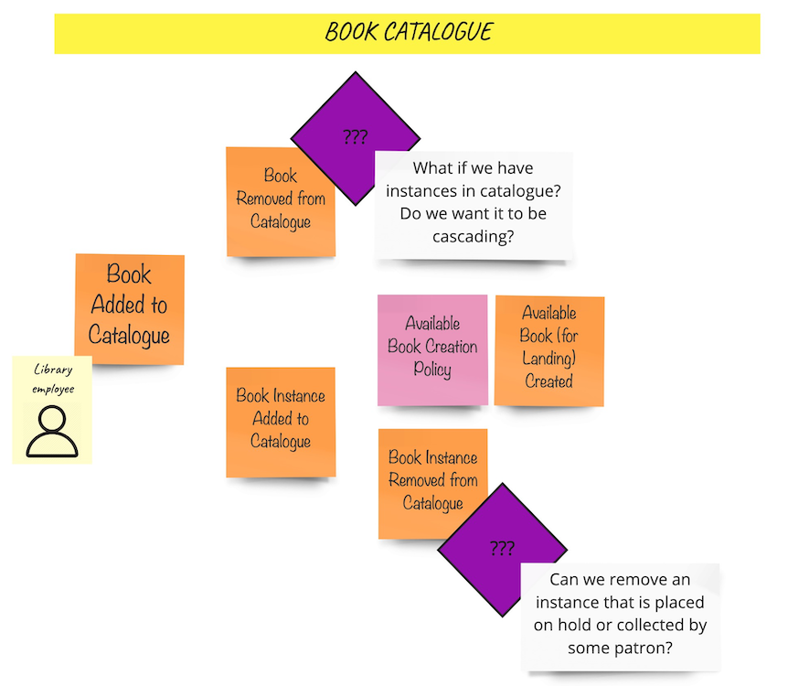
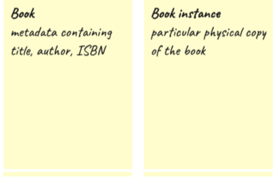

# Big Picture EventStorming

We started the domain exploration with sticky notes and a pen. What turned out to be the first discovery,
was the **close-ended book holding** process:
  
  
  
Let's briefly walk through it:
- A **Regular Patron** can **place a book on a close-ended hold**  
- A **Regular Patron** might **reach a maximum holds number** after a **hold is placed**  
- A **Regular Patron** can either **cancel the hold** or **check out the book**  
- While the book is **checked out** the **hold is completed** and so the **returning process** starts  
- Whenever a new day starts, we check the **daily sheet** if a hold is not hanging for too long. If so,
the **book hold is expired**  

On the high level, the process looks clear now, but it does not work the way, that all of us
interpreted each word written no the sticky note similarly. That's why we established some definitions:  

  

Similar discoveries were made around **open-ened book holding** process:  

  

- A **Researcher Patron** can **place a book on an open-ended hold**
- A **Researcher Patron** can either **cancel the hold** or **checkout a book**
- While the book is **checkedout** the **hold is completed** and so the **returning process** starts
- Within the **open-ended holding** a **hold** cannot **expire** (mind the lack of **hold expired** event)

All right. These two processes are very similar. The part that they have in common, and we know nothing about
it yet is called the **book returning process**:

  

Here's what you see there described with words:
- **Any Patron** can **return a book**
- If the **checkout is overdue**, it is being unregistered as soon as the **book is returned**
- In the moment of **returning a book** we start the process of **Fees application**
- From the moment of **book checkout**, a patron might not return the book on time. Whenever a **new day starts**
we check the **daily sheet** find and **register overdue checkouts**

Wait, but what is this **checkout**?  

  

_- OK, now tell me what is this fee application process_  
_- Nope, it is not relevant by now, will get back to it later_  
_- But wait, why? Shouldn't you get the full picture from the storming?_  
_- Yes, but remember, the time has its cost. You always need to focus on the most relevant (at this moment) business part.
I promise to get back to this at the next workshop._  
_- Fair enough!_  

Fundamental question that raises now is _where do these books come from?_ Looking again at the domain description,
we have a notion of a **catalogue**. We modelled it accordingly:  

   

Here's what happens:
- A **library employee** can add a book into a catalogue
- A specific **book instance** can be **added** as well, thanks to which it can be made **available** under some not 
defined yet policy
- Both **Book removed from catalogue** and **Book instance removed from catalogue** are marked with **hot spots**,
as they became problematic. We left answering those problems for the future.  

There is one interesting thing we can spot in this simple **catalogue** flow. **A book** is not the same **book** that
we had in previous processes. To make things clear, let's have a look at new definitions:

    

Spotting such differences helps us in drawing linguistic boundaries, that are one of the heuristics for defining 
**bounded contexts**. From this moment on, we can assume that we have at least two **bounded contexts**:
* **lending** - context containing all business processes logically connected with book lending, including holding, 
checkout, and return
* **catalogue** - contexts for cataloguing books and their instances

__More information on bounded contexts' defining will be added soon__

This is more or less where the first iteration of _Big Picture EventStorming_ finished. After this phase
we had a good understanding of how library processes work on high level, and, what is an invaluable outcome,
we got the **ubiquitous language** including well described definitions, and initial **bounded contexts**.