# Design Level EventStorming

As soon as we got our examples written down, we could start digging deep into each of them, identifying key interactions
with the system, spotting business rules and constantly refining the model. In the following sections you will
find mentioned examples modelled with Design Level EventStorming.

## Holding
### Regular patron

The first example is _the one when regular patron tries to place his 6th hold_:
   
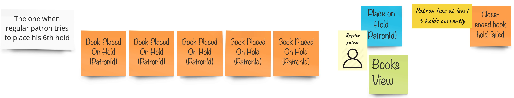  

What you can see here is that we are assuming, that a particular patron has already placed 5 books on hold.
Next, in order to place one more, a patron needs to interact with _the system_ somehow, so this is the reason
for placing a blue sticky note representing a command called **place on hold**. In order to make such decision,
a patron needs to have some view of the book that can be potentially placed on hold (green sticky note).
Because the regular patron cannot place more than 5 books on hold, we could identify a rule (rectangular yellow sticky note),
that describes conditions that needs to be fulfilled for the **Book hold failed** event to occur.

Fair enough, let's go further.

When a **patron** tries to place on hold a book that is currently not available it should not be possible, thus resulting
in **book hold failed** event, as it is depicted below:

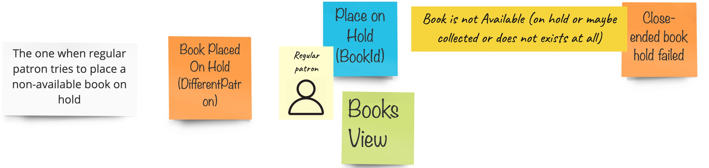  

Taking a look at the domain description again, we find out that each patron can have no more than 2 **overdue checkouts**.
In such situation, every attempt to **place a book on hold** should fail:

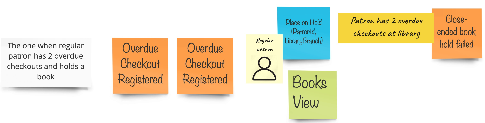  

If we are talking about **regular patrons**, what is special about them is that they are not allowed to hold a
**restricted book**:
  
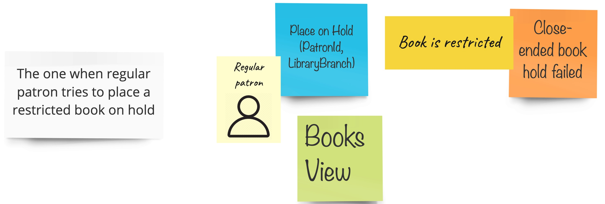

Second thing that is not allowed for a **regular patron** is **open-ended** hold: 
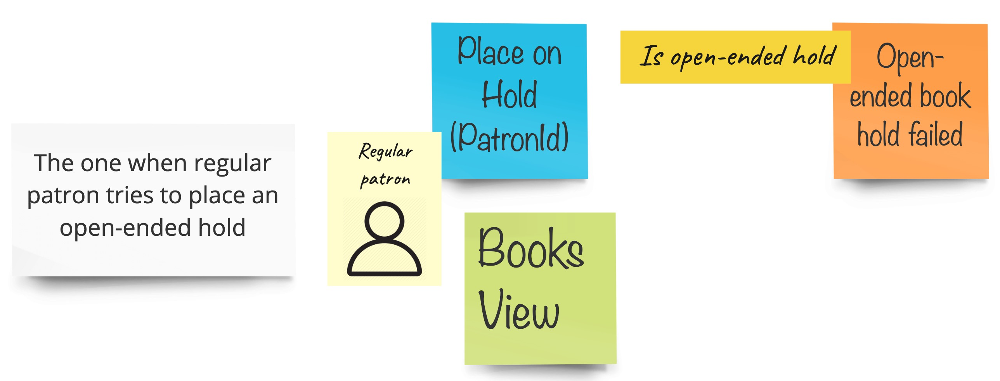    

All right, enough with failures, let patrons lend some books, eventually:
  
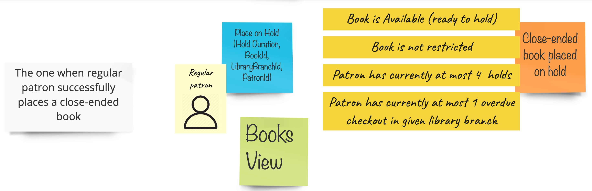  

Having in mind all previous examples, we discovered following conditions that need to be fulfilled for **patron** to
**place a book on hold**:
* Book must be available
* Book must not be **restricted**
* At the moment of placing a hold, a patron cannot have more than 4 holds
* Patron cannot have more than 1 overdue checkout

And here is the last example, partially covered before:

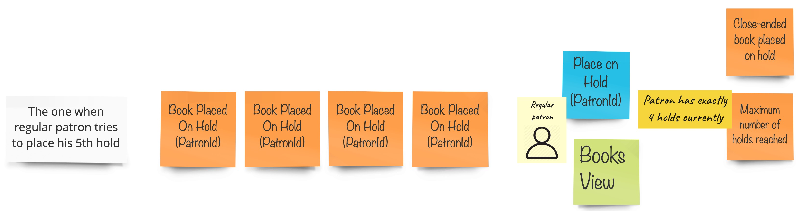  

### Researcher patron

In the previous part of this paragraph we focused on a *regular patron* only. Let's have a look at *researcher patron* now.
The domain description clearly states that **any** patron with more than 2 **overdue checkouts** will get a rejection
when trying to place book on hold. So we have it modelled:
  
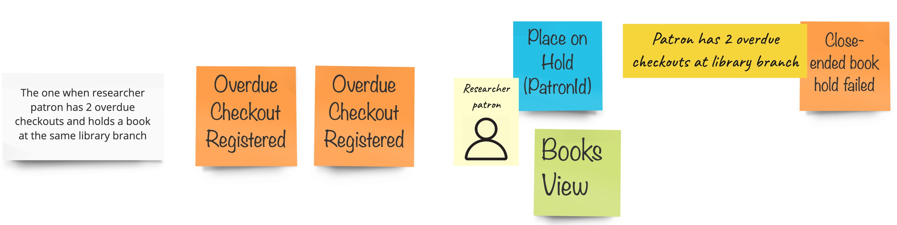  

There is also no exception in terms of holding a book that is **not available**:

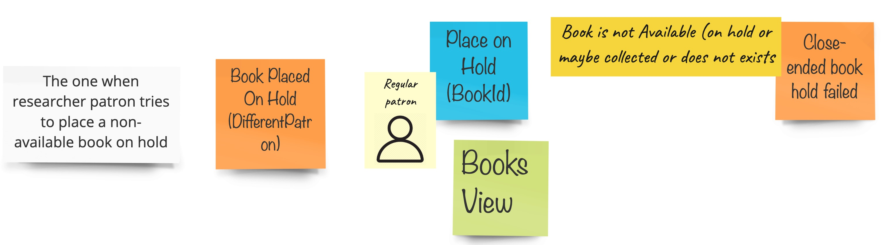  

The thing that differentiates **researcher patron** from a **regular** one is that he/she can place on hold a **restricted**
book:

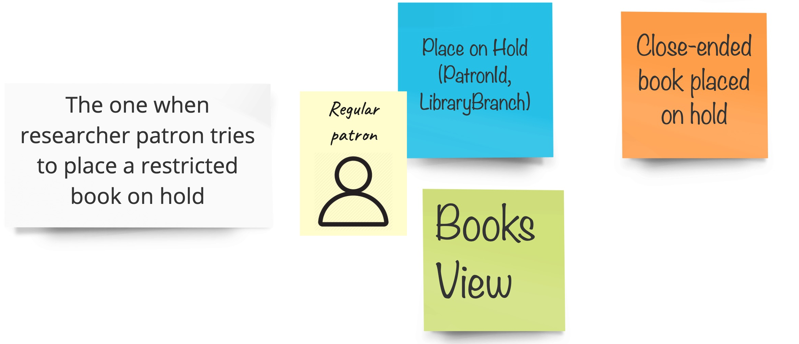  

Last three examples depict successful holding scenarios:

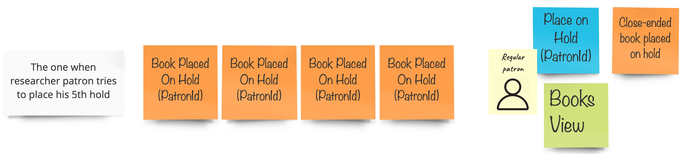  
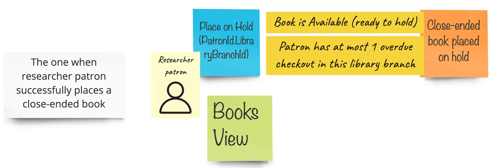  
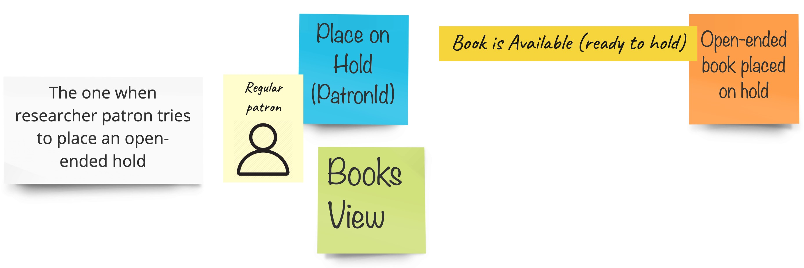    

## Canceling a hold

Any patron can cancel the hold. The unbreakable condition to be fulfilled is the one that the hold exists.
If it is not the case **book hold cancelling failed** event occurs. What you can spot here is that now the **patron**,
in order to cancel a hold, he/she needs to have a view of current holds (mind the **Holds view** green sticky note).

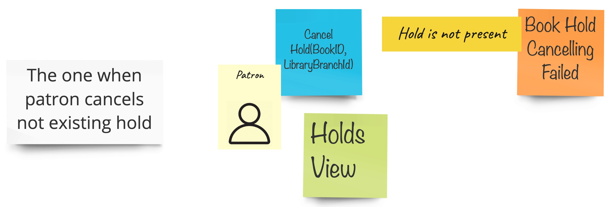  

If the hold is present, then it should be possible to cancel it:

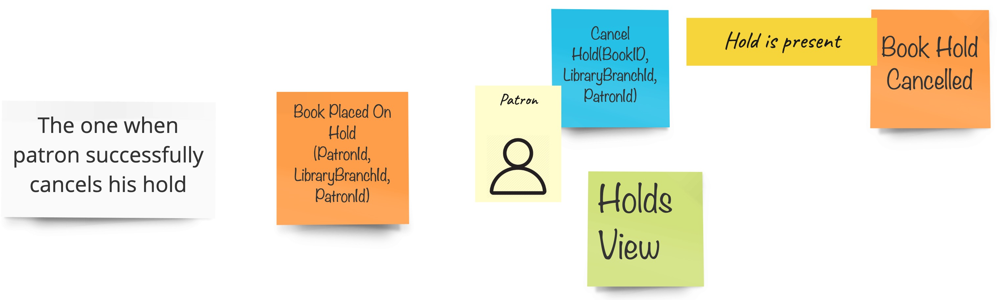  

We also need to take care of the scenario when a **patron** tries to **cancel a hold** that was actually
not placed by himself/herself:

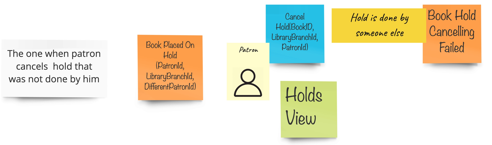  

It shouldn't be also possible to **cancel a hold** twice:

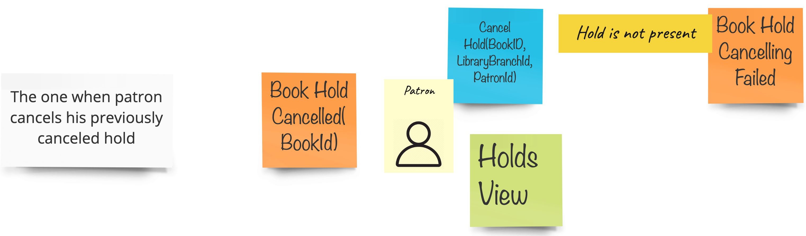  

Getting back to holding-related examples, let's try to join them with hold cancellation. Each **patron** can have no more
than five holds at a particular point in time. Thus, cancelling one of them should be enough for **patron** to **place
on hold** another book:
  
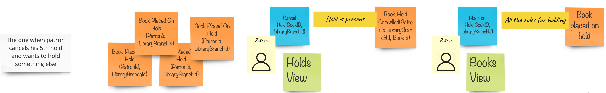  

## Checkout

Checking out is actually the essence of library functioning. **Any patron** can checkout a hold, but it is only possible
when the **hold** exists:
 
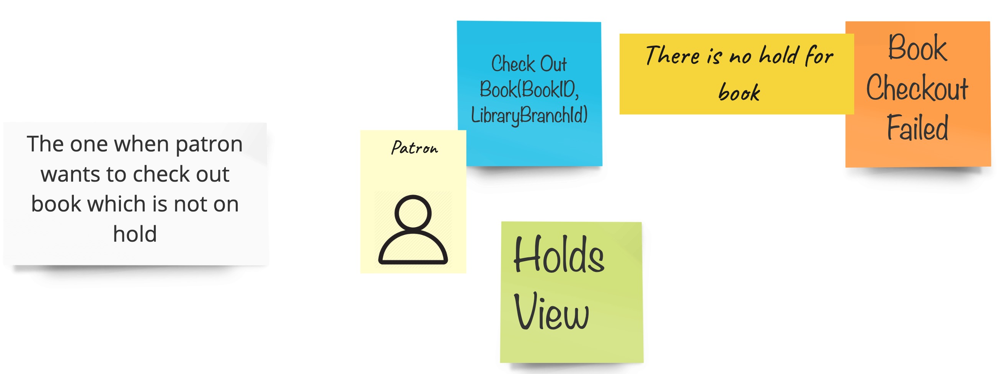  

It is also not allowed to checkout someone else's hold:

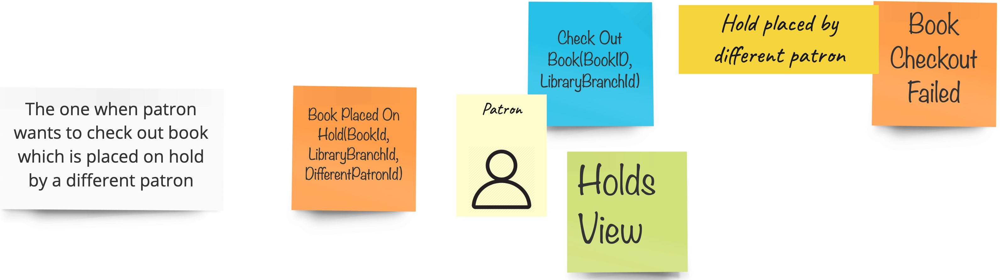  

An example summing things up is depicted below:

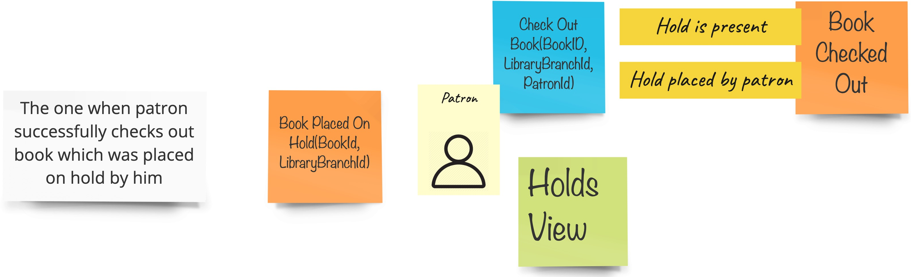  

A real-life scenario could be that a **patron** cancels his/her hold, and tries to check the book out:
 
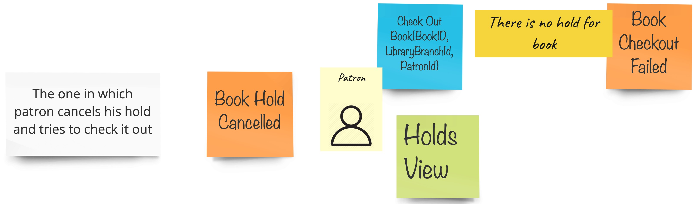  

It might also happen that a **patron** has the hold, whereas the book is missing in a library:
  
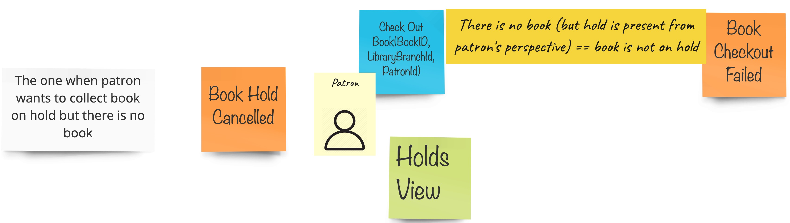  

## Expiring a hold

According to the domain description, any **close-ended hold** is active until it is either checked out by **patron** or
expired. The expiration check is done automatically by the system at the **beginning of the day**. In order to find holds
that qualify to expiration, a system needs to have a read model of such entries. Domain description names it a **Daily sheet**
(please mind the green sticky note)

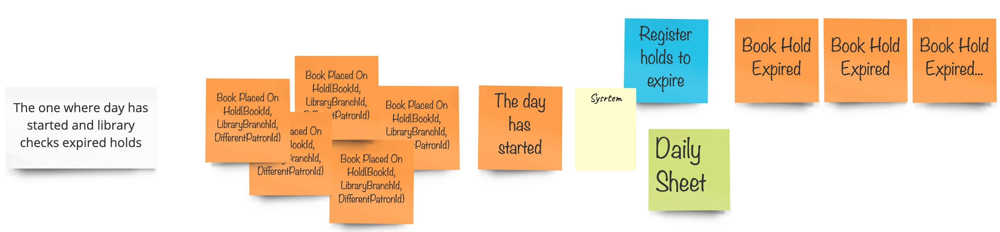  

When the book is **placed on hold** and the hold is **cancelled** before its expiration due date, it shouldn't be registered
as expired hold:

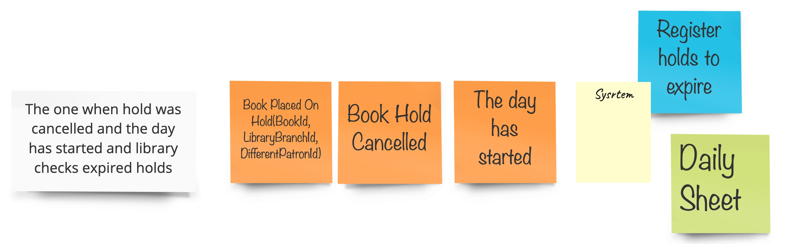  

The expiration check should mark each hold as expired only once:

  

## Registering overdue checkout

Each book can be checked out for not longer than 60 days. **Overdue checkouts** are identified on a daily basis by looking
at the **Daily sheet** (please mind the green sticky note):
 
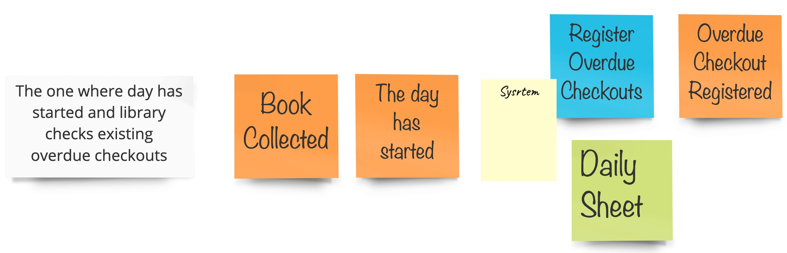  

Moreover we do not expect the **returned book** to be ever registered as **overdue checkout**:

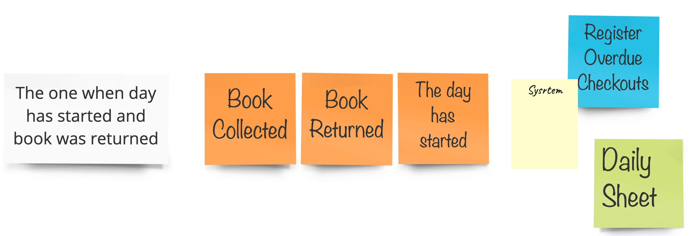  

## Adding to catalogue

The last area of analysis is the book **catalogue**. Catalogue is a collection of books and their instances.
A book instance can be added only when there is a book with matching ISBN already registered in the catalogue:
   
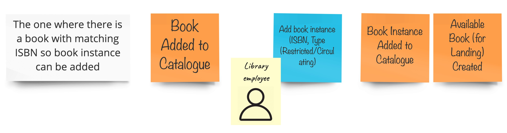  

If this is not the case, adding a book instance into catalogue should end up with failure.
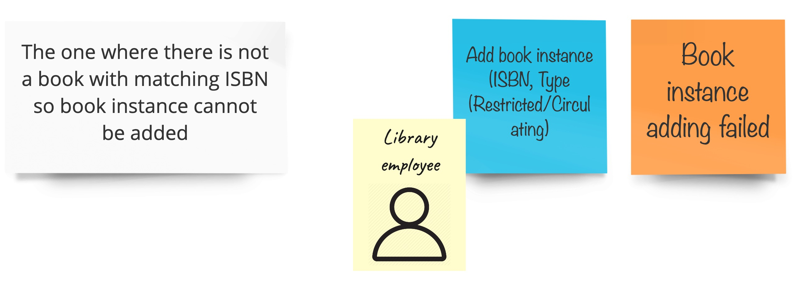  


## Bounded Context Classification

Until now, we have already identified two **bounded contexts** - **lending contexts**, and **catalogue contexts**.
Having in mind the domain description, and looking at the amount of discovered business rules, we can clearly see,
that **lending context** is the one that requires a lot of attention. Comparing the business complexities of both
contexts led us to conclusion that using **tactical building blocks** of **Domain Driven Design** and applying 
**hexagonal architecture** are a reasonable choice for **lending context** while **catalogue context** is just
a simple **CRUD**, and applying the same local architecture would be over-engineering.

You may ask yourself now: __how do you know that **catalogue context** is a CRUD?__. Here's a heuristic.
If most of the events, named as verbs in past tense, are triggered by commands, being named with the same verbs
but as imperatives, then it means we are probably just creating, updating, or deleting an object from some database.
Moreover, if there are no specific (or very little) business rules, then it might suggest that the essential complexity
sourced in the business is low enough for CRUD to be well applicable. 

## Aggregates

What you could see in the above examples is that we have not specified the **aggregates** that would be responsible for
handling commands and emitting events.
Such approach keeps us away from being steered into a particular solution/language and consequently limited from the very
beginning. Looking at behaviours and responsibilities first lets us understand the problem better, and thus find
a better name of the **aggregate**. In this paragraph you will see how we worked out the final aggregate model.

The first shot was to use **Book** as an aggregate. We are __placing **a book** on hold__, __cancelling the hold for **a book**__,
__checking **a book** out__ - all this sentences make logical sense, and even suits linguistically:

  

The first question that raised, was: __What about the invariants? Do they apply to a book?__. Well, not only.
When you take a look again at the rules that we discovered in previous paragraphs, you will see things like:
* is the patron a **regular** one or a **researcher**?
* is patron's maximum number of holds reached?
* is patron's maximum number of patron's overdue checkouts reached?
* is book available?
* is book restricted?
Book availability and its potential restriction (which is actually a property/characteristic) does not seem to be 
as critical as those connected with patrons. Secondly, we have more patron-related rules than book-related ones.

OK, but why don't we just pass the **Patron** object into **Book's** methods like:  
```java
book.placeOnHoldBy(patron);
```
We could, but it is the **patron** that knows more invariants, and we do not want to let any other object to protect them.
Here is the alternative, then:

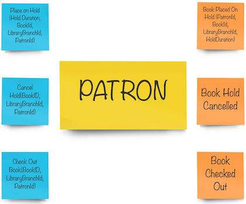  

Okay, so now in order to for example __place a hold__ we need to pass a **Book** object into a **Patron**, right?

```java
patron.hold(book);
```  

Then, if both patron's and book's invariants pass, we would modify patron and book aggregates. But doesn't it sound like
modifying two different aggregates in one transaction? Moreover, there is one more catch. Book's invariants (including its
availability) are just our "best wish". Our book model is just an abstraction of the real world books to lend in a library.
Why? Because in the real world a book that is placed on hold, might be found damaged or lost in the meantime.
Patron's invariants are more likely to be up to date and "driven" by our system. Gauges like number of holds, overdue checkouts
are much easier to be "real ones". This in turn means that it is okay to follow (suggested - after all) eventual consistency
model of inter-aggregate communication. It would make our model more realistic. Classes would be smaller, and easier
to work with and to maintain.

We have 2 aggregates now. We could revise the decision of *Patron* being the first aggregate to be modified, and the
**Book** being consistent in the future (eventually). We have already concluded that the **Book** is just a nice
projection of the real world plus patron has more invariants to drive the process. Also, these invariants are more
likely to be relevant. It is also probably less harmful, then, to place on hold a book which is actually not available
(and run compensation process) than let patrons place books on hold while having overdue checkouts.

Now the final model is following:

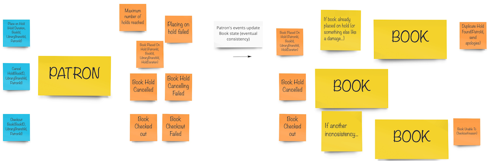  
