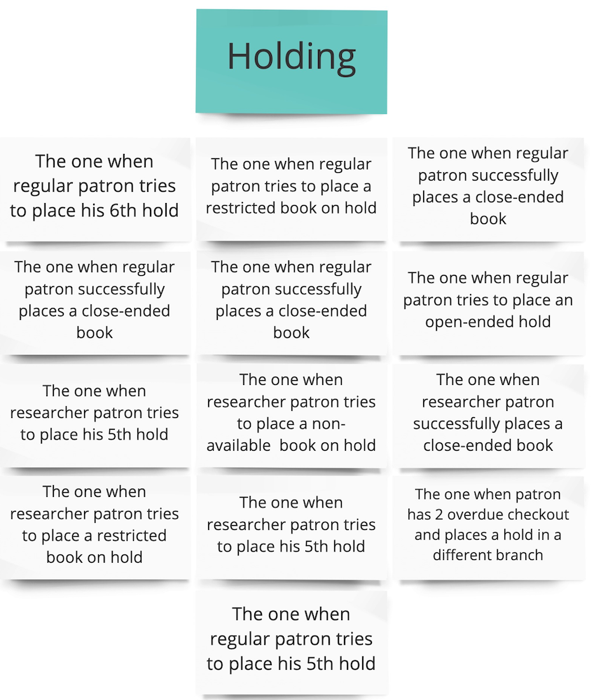
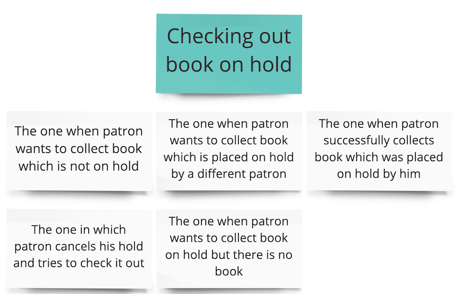
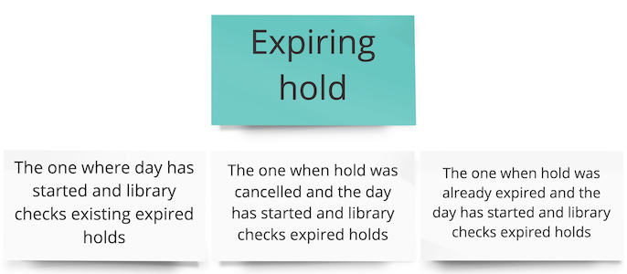
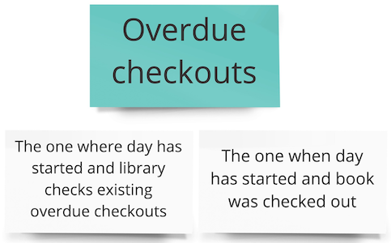
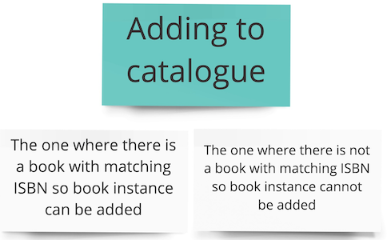

# Example Mapping

After the Big Picture EventStorming we had a high level overview of the domain. The next step could have been
to start Design Level EventStorming right away. EventStorming, considered as a tool, can be modified
and adjusted to current needs, thus taking different forms. We could have dug deeper into the topic during Big Picture
session and model all possible paths and scenarios with events, policies and rules then. In that case, 
it might have been difficult to spot particular business scenarios and prioritize them, as they would be spread
throughout the wall. The alternative that we chose to apply, was to discover those scenarios first, and model each
of them separately with Design Level EventStorming. The intermediate step is called Example Mapping. In the following 
paragraphs, you will find results of this session.

_Please note that this is a simplified variation of Example Mapping, where we just group examples by business areas,
not focusing on the rules, or use cases from the original technique_
  
## Holding

## Checkout

  

## Expiring hold

 

## Canceling hold

## Overdue checkouts

  

## Adding to catalogue

